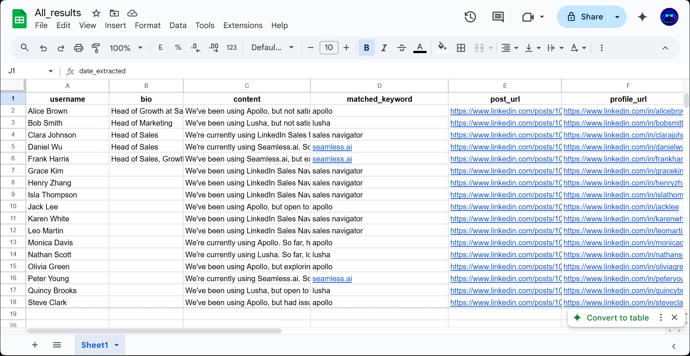
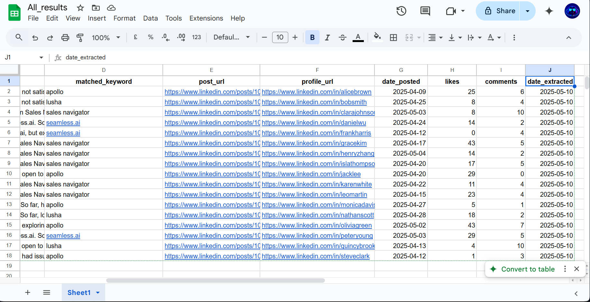
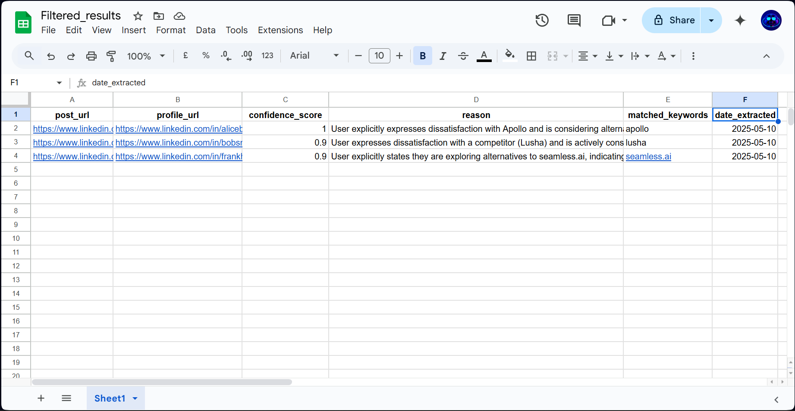

# 🔍 LinkedIn Lead Qualification Automation (n8n)

This project filters and qualifies LinkedIn posts using keyword rules and Ideal Customer Profile (ICP) logic. It deduplicates results and stores high-confidence matches in a structured format with the date of extraction.

> ⚠️ **Note:** Dummy data for posts, keyword rules, and ICP logic is already pre-defined within the provided workflow. You do **not** need to manually create `keywords.json` or `icp_config.json` unless you want to customize them.

---

## ▶️ How to Run It

1. **Set up n8n**  
   You can self-host n8n locally, deploy via Docker, or use the cloud version.

2. **Import the Workflow**  
   - Open n8n.
   - Import the provided `Keyword Tracker.json`.

3. **Configure Data Source**  
   - The workflow includes dummy LinkedIn post data for testing purposes.
   - You can connect your own HTTP/API node for real data if desired.

4. **Keyword & ICP Configs**  
   - Default keyword and ICP logic are already built into the workflow.
   - You can optionally replace or extend them by uploading your own `keywords.json` and `icp_config.json`.

5. **Run the Workflow**  
   - Trigger manually or on a schedule.
   - Output will be saved to Google Sheets with fields like `confidence`, `reason`, and `date_extracted`.

---

## 🧰 Tech Stack Used

- [n8n](https://n8n.io) – automation and workflow engine  
- JSON for input/output formats  
- Google Sheets for structured lead storage

---

## 📌 Assumptions and Limitations

- **Keyword logic** supports `AND` / `OR` conditions.
- Posts must match **at least one keyword rule AND the ICP criteria** to qualify.
- Engagement data (likes, comments) is optional but helps improve confidence scoring.
- Deduplication is based on the post URL.
- Dummy data is embedded for testing; for production, connect a LinkedIn scraping source.

---

## ✅ Expected Result

When the workflow is executed, it will generate two separate spreadsheets:

1. **`all_matched_results`** – contains **all posts** that match **any of the defined keywords**, regardless of ICP match.
2. **`filtered_results`** – contains only **qualified posts** that match both **keywords AND ICP criteria**, along with confidence scoring and reason.

These outputs help you distinguish between general interest and highly targeted leads.

### 📸 Sample Screenshots

**All Matched Results Preview:**

**Filtered Results Preview:**

---

## 📄 Sample Output

Two sample output files are included for quick review:

- 📁 [`all_matched_results.json`](all_matched_results.json)
- 📁 [`filtered_results.json`](filtered_results.json)

Alternatively, the same results can be viewed in Google Sheets or Airtable (linked separately if available).
