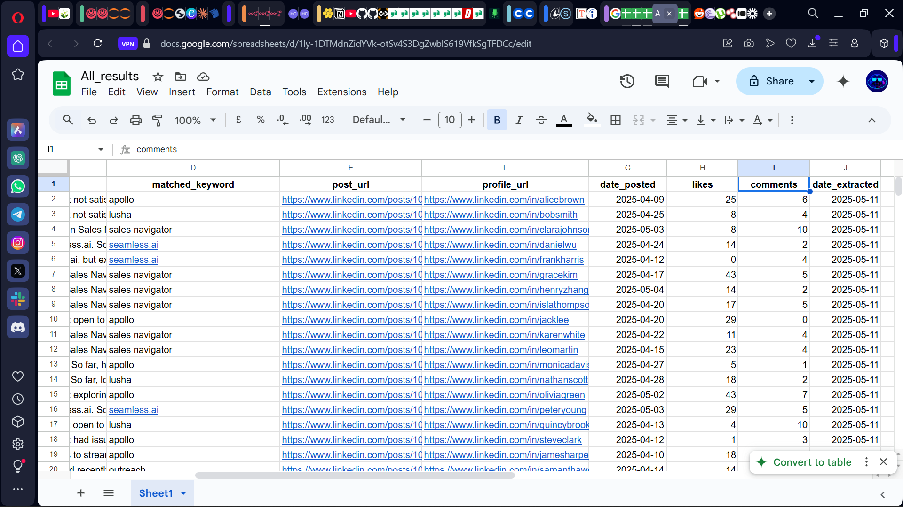
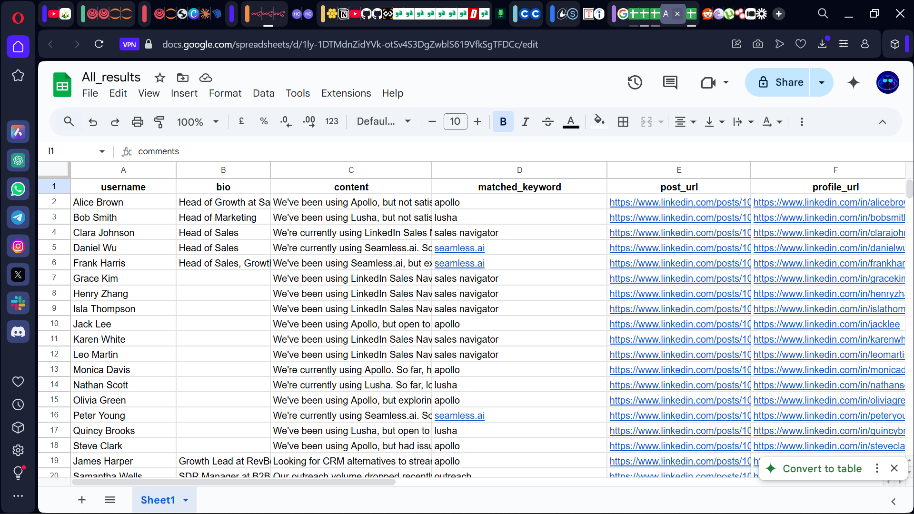
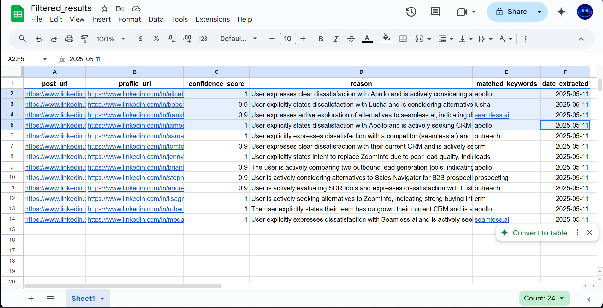

# 🔍 LinkedIn Lead Qualification Automation (n8n)

This project filters and qualifies LinkedIn posts using keyword rules and Ideal Customer Profile (ICP) logic. It deduplicates results and stores high-confidence matches in a structured format with the date of extraction.

> ⚠️ **Note:** Dummy data for posts, keyword rules, and ICP logic is already pre-defined within the provided workflow. You do **not** need to manually create `keywords.json` or `icp_config.json` unless you want to customize them.

---

## ▶️ How to Run It

1. **Set up n8n**  
   You can self-host n8n locally, deploy via Docker, or use the cloud version.

2. **Import the Workflow**  
   - Open n8n.
   - Import the provided `Keyword Tracker.json`.

3. **Configure Data Source**  
   - The workflow includes dummy LinkedIn post data for testing purposes.
   - You can connect your own HTTP/API node for real data if desired.

4. **Keyword & ICP Configs**  
   - Default keyword and ICP logic are already built into the workflow.
   - You can optionally replace or extend them by uploading your own `keywords.json` and `icp_config.json`.

5. **Run the Workflow**  
   - Trigger manually or on a schedule.
   - Output will be saved to Google Sheets with fields like `confidence`, `reason`, and `date_extracted`.

---

## 🧰 Tech Stack Used

- [n8n](https://n8n.io) – automation and workflow engine  
- JSON for input/output formats  
- Google Sheets for structured lead storage

---

## 📌 Assumptions and Limitations

- **Keyword logic** supports both `AND` and `OR` conditions as defined in a separate spreadsheet (or config file), making it easily editable without modifying code.
- **ICP matching** is based on title and bio fields using configurable role keywords (e.g., "Head of Growth", "Marketing", etc.), also editable via spreadsheet or config.
- Posts must match **at least one keyword AND one ICP role** to be considered valid for scoring and filtering.
- **Confidence scoring** is initially computed using hard-coded logic:
  - +0.2 for keyword match
  - +0.3 for ICP match
  - +0.1 for post likes > 10
  - +0.1 for comments > 3
  - Capped at 1.0
- **Trade-off**: Purely rule-based scoring is consistent and predictable but may miss nuances (e.g. tone, dissatisfaction hints, etc.). AI scoring via GPT is more nuanced but can be inconsistent or overly permissive.
- To balance this, I used a **hybrid approach**: rule-based scoring is applied first in the code node, and GPT then adjusts the score slightly (+/- 0.1) based on qualitative analysis like urgency, dissatisfaction, or intent to switch. This ensures accuracy while preserving human-like judgment.
- **Matched keywords** are exact or semantically aligned matches and must appear in the post or bio. GPT helps infer additional context but only after initial keyword filtering.
- **Deduplication** is done via the `post_url` field to ensure unique entries in the final outputs.
- **Date of extraction** is appended to each result for tracking and auditing purposes.
- **Engagement data** (likes, comments) is optional but helps improve scoring accuracy.
- Dummy data is used in this automation (via `dummy_data` node), but the system is designed to plug into a real-time source (e.g., LinkedIn scraper or Serper API).
- **Google Sheets** is used for dynamic keyword/ICP input and result output, but can be swapped for Airtable, or JSON files.
- **Limitations**:
  - No front-end UI.
  - AI-generated confidence scores may exceed 1.0 if not explicitly capped.
  - Posts with vague or minimal content may still be scored if the user profile aligns too well with the ICP and minimal keyword signals are present.

## ⏳ Optional Features (Not Implemented Due to Time Constraints)

- **Live data sourcing** via LinkedIn scraping or APIs like Serper was planned but skipped to focus on core filtering logic. The system is designed to accept such integrations easily.
- **Storage flexibility**: Google Sheets is used for both input (keywords, ICP titles) and output (results), but the workflow can be adapted for Airtable or other databases.
- **Scheduled extractions** and **alerting via Slack or email** are supported by n8n but were not included to keep the scope focused and manageable within the time limit.
- Instead I made intentional trade-offs to focus on accuracy and completeness.

---

## ✅ Expected Result

When the workflow is executed, it will generate two separate spreadsheets:

1. **`all_matched_results`** – contains **all posts** that match **any of the defined keywords**, regardless of ICP match.
2. **`filtered_results`** – contains only **qualified posts** that match both **keywords AND ICP criteria**, along with confidence scoring and reason.

These outputs help you distinguish between general interest and highly targeted leads.

### 📸 Sample Screenshots

**All Matched Results Preview:**

**Filtered Results Preview:**

---

## 📄 Sample Output

Two sample output files are included for quick review:

- 📁 [`all_matched_results.json`](results/All_results.json)
- 📁 [`filtered_results.json`](results/Filtered_results.json)
